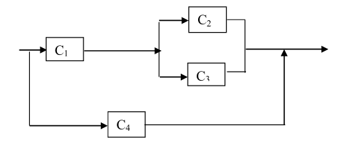

  

```{r setup, include=FALSE}
knitr::opts_chunk$set(echo = TRUE)
```

## Exercício 1 

Considerando o modelo com função de risco dada por:

$$h(t) = \delta t +\frac{\theta}{1+\beta t}, \ \ t> 0$$

onde $\beta \geq 0, \delta \geq 0\ e\ \theta \geq 0.$

Para verificar o comportamento de h, primeiramente vamos obter $h'(t) = \frac{\partial h }{\partial t}$  

$$h'(t) =
\frac{\partial }{\partial t}\left[ \delta t +\frac{\theta}{1+\beta t} \right] =
\delta +  \theta \ \frac{\partial }{\partial t}\left((1 + \beta t)^{-1} \right) = 
\\
\delta + \theta(-(1 + \beta t)^{-2}\ \frac{\partial }{\partial t}\left( 1 + \beta t \right) )  = 
\delta - \frac{\theta \beta}{(1 + \beta t)^{2}}$$
 
 - (a) $\theta = 0 \Rightarrow \ h$ é crescente

Se $\theta = 0$ então

$$h'(t) = \delta - \frac{0 \beta}{(1 + \beta t)^{2}} = \delta$$ 
Como $\delta > 0$, $h$ é crescente.

***

 - (b) $\delta = 0 \Rightarrow \ h$ é decrescente

Se $\delta = 0 \Rightarrow \ h$ então

$$h'(t) = 0 - \frac{\theta \beta}{(1 + \beta t)^{2}} = -  \theta \beta(1 + \beta t)^{-2} < 0$$ 
Pois  $t > 0, \ \beta \geq 0, e\ \theta \geq 0.$

***

 - (c) $\beta = \delta = 0 \Rightarrow \ h$ é constante

Substituindo os valores, temos que

$$h'(t) = 0 - \frac{0 \theta}{(1 + 0 t)^{2}} = 0$$ 
Portanto, $h(t)$ é constante.

***

 - (d) Quando $\delta \geq \beta \theta$, $h$ é crescente

$$h'(t) = \delta - \frac{ \theta \beta}{(1 + \beta t)^{2}} = \frac{\delta(1 + \beta t)^{2} -  \theta \beta}{(1 + \beta t)^{2}}$$ 
Portanto, $h(t)$ é constante.


 - (f)

```{r message = F}
library(tidyverse)
library(survival)
library(survminer)
library(KMsurv)
library(biostat3)
```
 
 
```{r}
h <- function(t, delta, theta, beta){
  delta*t + theta/(1 + beta*t)
}

h_prime <- function(t, delta, theta, beta){
  delta - (theta*beta)/(1+beta*t)^2
}
```


```{r}
t <- seq(0, 39)
delta <-  seq(0,39)
theta <- seq(0,39)
beta <- seq(0,39)

tibble(t, delta, theta, beta) %>% mutate(h = h(t,delta,theta,beta))

```

```{r}
tibble(t, delta, beta) %>% mutate(h = h(t,delta,0,beta)) %>%
  ggplot() +
  geom_line(aes(x = t, y = h )) +
  labs(title = expression("theta = 0"),
       y = "h'(t)")
```


```{r}
tibble(t, theta, beta) %>% filter(t>1) %>% mutate(h = h(t,0,theta ,beta)) %>%
  ggplot() +
  geom_line(aes(x = t, y = h )) +
  labs(title = expression("delta = 0"),
       y = "h'(t)")
```


```{r}
tibble(t, theta) %>% mutate(h = h_prime(t,0,theta ,0)) %>%
  ggplot() +
  geom_line(aes(x = t, y = h )) +
  labs(title = expression("beta = delta = 0"),
       y = "h'(t)")
```


```{r}
# D) delta >= beta * theta
tibble(t, delta = theta*beta, theta, beta) %>%
  mutate(h = h(t, delta, theta ,beta)) %>%
  ggplot() +
  geom_line(aes(x = t, y = h )) +
  labs(title = expression("theta = 0"),
       y = "h(t)")
```

```{r}
# E) 0 < delta <= beta * theta
tibble(t, delta = delta/(theta*beta), theta, beta) %>%
  mutate(h = h(t, delta, theta ,beta)) %>%
  ggplot() +
  geom_line(aes(x = t, y = h )) +
  labs(title = expression("theta = 0"),
       y = "h(t)")
```

***

## Exercício 1 - Lista 2



### (i) confiabilidade do sistema por 8 meses 

Considere $T$: tempo em anos até a falha do sistema.

$T_i = $ tempo até a falha do i-ésimo componente, $i = 1,..., 4$

$$f_i(t,\beta) = 
          \begin{cases}
          \ 2 \beta t e^{- \beta t^2},\ t > 0\ ;\  \ \ i = 1,...4\\
         \  0, \ \text{    c.c.}
            \end{cases} \ $$
            
Note que $T_i \sim \textbf{Weibull}(2,\beta)$. Assim:
            
$$R_i(t) = e^{-\beta t^2}, \ t> 0,\ i = 1,...,4$$

  - $C_2$ e $C_3$ estão em paralelo, logo:
 
$$R_{23}(t) = 1 - \prod_{i = 1}^2 (1 - R_i(t)) = 1 - (1 - e^{-\beta t^2})^2 = \\
  1 - (1 - 2 e^{-\beta t^2} + e^{-2 \beta t^2}) = 2e^{-\beta t^2} - e^{-2\beta t^2}$$

  - $C_2$ e $C_3$ estão em série com $C_1$, logo:
  
$$R_{123} = R_1(t)R_{23}(t) = e^{-\beta t^2}(2e^{-\beta t^2}-e^{-2\beta t^2})\\
  = 2e^{-2\beta t^2}- e^{-3\beta t^2}$$

  - $C_4$ está em paralelo com $C_1$, $C_2$, $C_3$, assim:
  
$$R(t) = 1 - (1-R_4(t)(1-R_{123}(t)) =\\
1 - (1 - e^{-\beta t^2})(1-2e^{-2\beta t^2}- e^{-3\beta t^2}) = $$

$$1 - (1 - 2e^{-2\beta t^2}- e^{-3\beta t^2} + e^{-\beta t^2} -2e^{-3\beta t^2} - e^{-4\beta t^2}) = \\ 
2e^{-2\beta t^2}-3e^{-3\beta t^2} +e^{-\beta t^2}+e^{-4\beta t^2}$$

Como queremos a confiabilidade por um período de 8 meses (2/3 ano):

$$R(2/3) = 2e^{- \frac 89 \beta}-3e^{- \frac{12}9 \beta} +e^{-\frac49 \beta }+e^{- \frac{16}9 \beta }$$

### (ii) média de vida do sistema

$$E(T) = \int_0^\infty R(t) dt = \int_0^\infty 2e^{-2\beta t^2} dt -\int_0^\infty 3e^{-3\beta t^2} dt + \int_0^\infty e^{-\beta t^2} dt + \int_0^\infty e^{-4\beta t^2}dt$$


$$\int_0^\infty 2e^{-2\beta t^2} dt =
2 \sqrt{\frac{2 \pi}{4 \beta}} \int_0^\infty \sqrt{\frac{4 \beta}{2 \pi}} e^{- \frac{t^2}{2(\frac14 di\beta)} } dt  = 
\frac32 \sqrt{\frac{\pi}{2 \beta}}$$


$$\int_0^\infty e^{-\beta t^2} dt =
\sqrt{\frac{2 \pi}{2 \beta}} \int_0^\infty \sqrt{\frac{2 \beta}{2 \pi}} e^{- \beta t^2} dt  = 
\frac12 \sqrt{\frac{\pi}{ \beta}}$$


$$\int_0^\infty e^{-4\beta t^2} dt =
\sqrt{\frac{2 \pi}{8 \beta}} \int_0^\infty \sqrt{\frac{8 \beta}{2 \pi}} e^{- \frac{t^2}{2( \frac18 \beta)} } dt  = 
\frac12 \sqrt{\frac{\pi}{4 \beta}}$$

Assim, temos:

$$E(T) = \frac32 \sqrt{\frac{\pi}{2 \beta}} - \frac32 \sqrt{\frac{\pi}{2 \beta}} + \frac12 \sqrt{\frac{\pi}{ \beta}} + \frac12 \sqrt{\frac{\pi}{4 \beta}} $$

## Exercício 2 - Lista 3

### (a)

Considere $T:$ tempo em semanas até remissão da leucemia;
$T_i:$ tempo de remissão do i-ésimo paciente, com $i = 1,...,30$.

```{r}
df <- tibble(t = c(1, 1, 2, 4, 4, 6, 6, 7, 8, 9,
                 9, 10, 12, 13, 14, 18, 19, 24, 26, 29,
                 31, 42, 45 ,50, 57, 60, 71, 85, 91),
             d = c(0, 0, 0, 0, 0, 0, 0, 0, 0, 0,
                 0, 0, 0, 0, 0, 0, 0, 0, 0, 0,
                 1, 0, 1, 1, 0, 0, 1, 1, 0))
```

```{r}
km_fit <- survfit(Surv(t, d) ~ 0, data = df)
```

```{r}
summary(km_fit, times = seq(0,90,10))
```
 

```{r}
ggsurvplot(km_fit)
```

```{r}

(x <- lifetab2(Surv(t,d==1)~0, df, breaks = seq(0,90,10)))
```


```{r}
biostat3::plot.lifetab2(x)
```

Ambos os estimadores obtiveram valores similares, devido ao número de intervalos ser o mesmo. Tal comportamento não seria esperado no caso de um número diferente de intervalos em cada estimador.

## Exercício 6 - Lista 4

Seja $T = $ tempo(semanas) até a remissão de um grupo de pacientes com leucemia. Tem-se que $T \sim \text{Weibull}(\alpha,\beta)$. Assim

$$L(\alpha, \beta, t_i) = 
\prod_{i=1}^n ( h(t_i,\alpha, \beta))^{\delta_i} S(t_i; \alpha, \beta)=  \\
\prod_{i=1}^n (\alpha \beta t_i^{\alpha-1})^{\delta_i} e^{- \beta t_i^\alpha} = \\
\alpha^r \beta^r \exp{(-\beta \sum^n_{i=1} t_i^\alpha + (\alpha - 1) \sum^n_{i=1} \delta_i \ln(t_i))}$$

em que $r = \sum_{i=1}^n \delta_i$, com $\delta_i$ um indicador que não houve censura.

$$l(\alpha, \beta) = r \ln{\alpha} + r \ln{\beta} - \beta \sum^n_{i=1} \delta_i \ln t_i$$
$$\frac{\partial l ( \alpha,  \beta)}{\partial \alpha} = \frac r \alpha - \beta \sum_{i=1}^n t^\alpha_i \ln(t_i) + \sum_{i=1}^n \delta_i \ln(t_i) = u_1$$

$$\frac{\partial l ( \alpha,  \beta)}{\partial \beta} = \frac r \alpha - \beta \sum_{i=1}^n t_i^\alpha = u_2$$


$$\frac{\partial^2 l ( \alpha,  \beta)}{\partial \alpha^2} = 
- \frac{r}{\alpha^2} - \beta\sum_{i=1}^n t_i^\alpha (\ln{(t_i))^2}$$

$$\frac{\partial^2 l ( \alpha,  \beta)}{\partial \beta^2} = - \frac{r}{\beta^2}$$

$$\frac{\partial^2 l ( \alpha,  \beta)}{\partial \alpha \partial \beta} = 
\sum_{i=1}^n t_i^\alpha \ln(t_i)$$

Agora, fazendo

$$\left[ \frac{\partial l ( \alpha,  \beta)}{\partial \beta} \right]_{\beta = \hat \beta} = 0 \Rightarrow \hat \beta = \frac r {\sum_{i=1}^n t_i^\alpha}$$

Substituindo $\hat \beta$ em $\frac{\partial l ( \alpha,  \beta)}{\partial \alpha}$ segue:

$$u_1 = \frac r \alpha - \frac{r \sum_{i=1}^n t^\alpha_i \ln(t_i)}{\sum_{i=1}^n t_i^\alpha} + \sum_{i=1}^n \delta_i \ln(t_i)$$

Pelo método de Newton-Rapson, obtemos os EMV de $\alpha$ e $\beta$:
$\hat \alpha= 1,407,\ \hat \beta = 0,044$

### b

Sabe-se que
$$t_{0,5} = \beta^{-\frac 1 2} (\ln2)^{-\frac 1 2} \Rightarrow
t_{0,5} = 7,137$$


